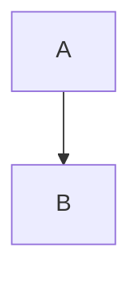
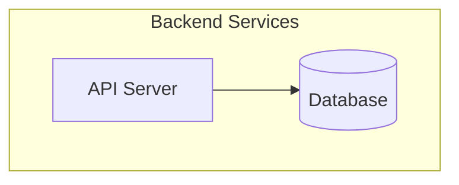
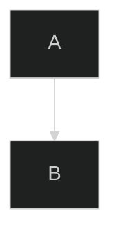

# Custom Directives

arch-explorer extends Mermaid syntax with custom directives using the `%%{arch: ...}%%` format.

## Basic Syntax



The directive must be on the first line, before any Mermaid content.

## Directive Options

### view

Controls the rendering mode.

| Value | Description |
|-------|-------------|
| `"flat"` | Standard 2D SVG rendering (default) |
| `"iso"` | Isometric projection with 3D appearance |

```mermaid
%%{arch: {view: "iso"}}%%
```

### nav

Controls the navigation mode when clicking subgraphs.

| Value | Description |
|-------|-------------|
| `"drill"` | Replace view with subgraph contents, breadcrumb back (default) |
| `"layer"` | Overlay children above parent, parent becomes ghosted |
| `"fold"` | Collapse/expand subgraphs in place |

```mermaid
%%{arch: {nav: "layer"}}%%
```

## Combined Example



## Default Values

If the directive is omitted or partial:

```typescript
const defaults = {
  view: "flat",
  nav: "drill"
}
```

## Future Extensions

Planned directive options (not yet implemented):

### height (isometric depth)

```mermaid
%%{arch: {view: "iso", height: 2}}%%
```

### theme

```mermaid
%%{arch: {theme: "dark"}}%%
```

### animate

```mermaid
%%{arch: {animate: true}}%%
```

## Compatibility with Mermaid

The `%%{...}%%` syntax is Mermaid's directive format. arch-explorer uses a custom key (`arch`) to avoid conflicts with standard Mermaid directives like `init` or `theme`.

Standard Mermaid directives still work:


