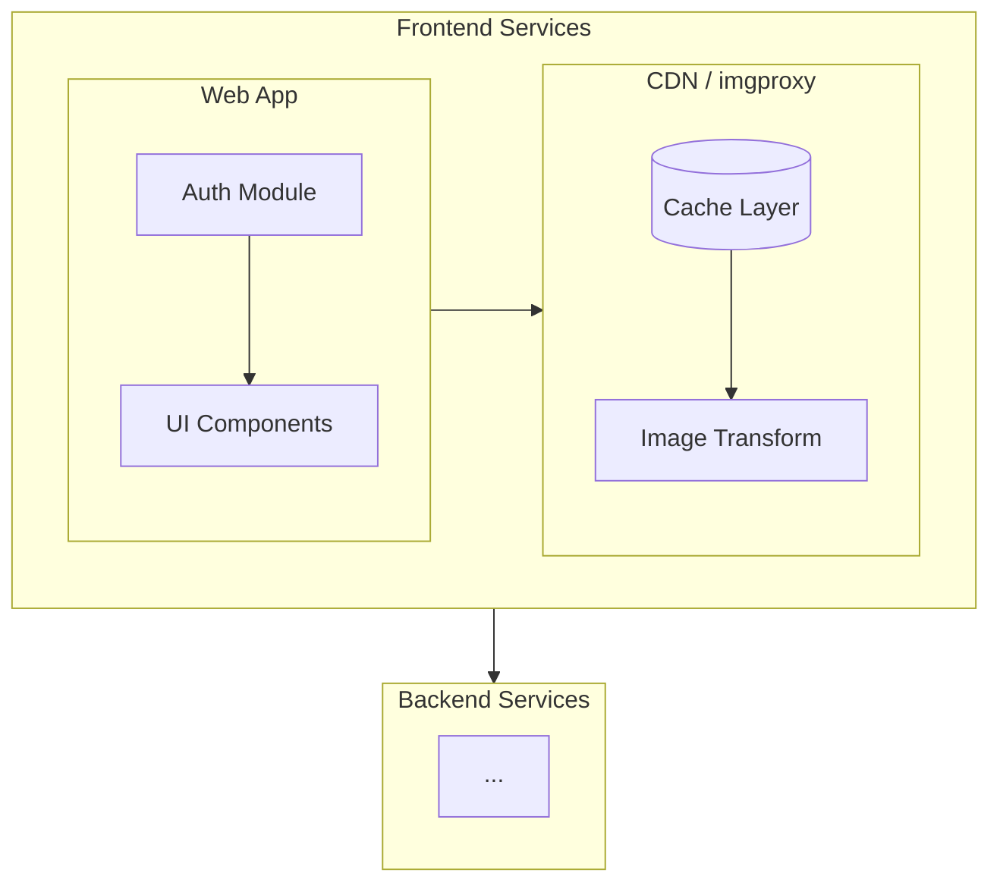

# Getting Started

This tutorial walks you through setting up arch-explorer and rendering your first architecture diagram.

## Prerequisites

- Node.js 18 or later
- npm or yarn

## Step 1: Install Dependencies

```bash
npm install
```

This installs:
- **React** - UI framework
- **Mermaid** - Diagram syntax parser
- **dagre** - Graph layout engine
- **d3-zoom/selection** - Pan and zoom handling

## Step 2: Start the Development Server

```bash
npm run dev
```

Open your browser to the URL shown (typically `http://localhost:5173`).

## Step 3: Understanding the Sample Diagram

The project includes a sample diagram at `sample.mmd`:



Key elements:
- `%%{arch: ...}%%` - Our custom directive for view/nav settings
- `flowchart TD` - Standard Mermaid top-down flowchart
- `subgraph` - Groups of related nodes (these are drillable)
- `[(Database)]` - Cylinder shape for databases
- `-->` - Directed edges

## Step 4: Modify the Diagram

Try editing `sample.mmd`:

1. Add a new node inside a subgraph
2. Connect it with an edge
3. Save and see the view update

## Next Steps

- [Your First Isometric View](./first-isometric.md) - Toggle to 3D mode
- [Navigation Basics](./navigation-basics.md) - Drill into subgraphs
