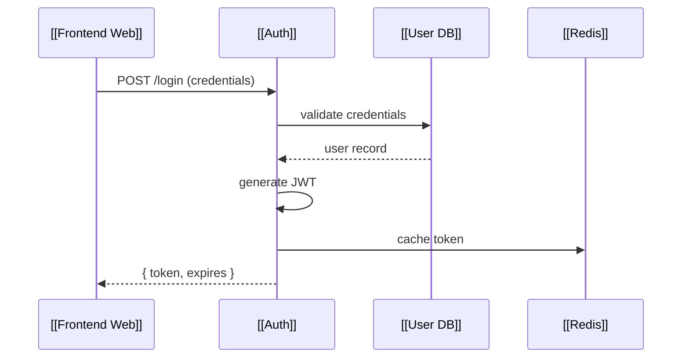
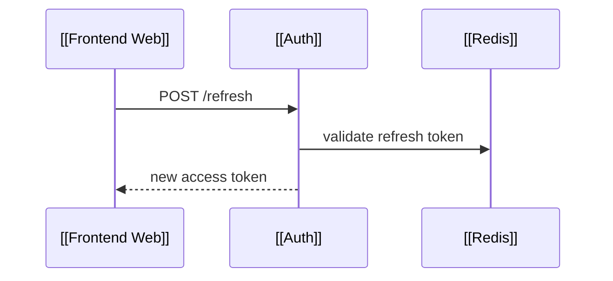
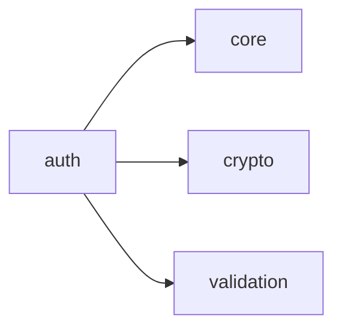

# Entity-Centric Architecture Diagrams

## Summary of Change

We're shifting from **document-centric** (diagrams as top-level artifacts) to **entity-centric** (components as top-level, diagrams as views).

This is the Roam Research model applied to architecture documentation.

```
BEFORE                              AFTER
──────                              ─────
architecture.mmd                    Auth.arch.md
sequence-login.mmd        →        ├── description, metadata
erd-users.mmd                      ├── [[connections]] to other components
                                   ├── embedded mermaid views
                                   └── backlinks (auto-computed)

Diagrams are the artifact.         Components are the artifact.
                                   Diagrams are views of components.
```

---

## Roam Patterns We're Adopting

| Roam Concept | Our Implementation | Purpose |
|--------------|-------------------|---------|
| Page | Component file (`.arch.md`) | Single source of truth per entity |
| `[[wikilink]]` | `[[ComponentName]]` in markdown AND mermaid | Connect everything |
| Backlinks | Auto-computed panel | "What references this?" |
| Graph view | Architecture overview | Visual navigation |
| Tags | `#service #database #deprecated` | Filtering, queries |
| Block embed | `{{embed: [[Auth]]/Sequences/Login}}` | Reuse without duplication |
| Daily notes | Changelog / decision log | Temporal entry point |

---

## The Key Insight: `[[wikilinks]]` Inside Mermaid

Standard mermaid nodes are anonymous—same label doesn't mean same entity:

```mermaid
%% These "Auth" nodes are unconnected
flowchart TD
    Auth --> API
    
sequenceDiagram
    Frontend ->> Auth: login
```

With wikilinks, we create explicit identity:

```mermaid
flowchart TD
    [[Auth]] --> [[API]]
    
sequenceDiagram
    [[Frontend]] ->> [[Auth]]: login
```

Now both `[[Auth]]` references point to the same component. Clicking either navigates to Auth's component page.

### Syntax

```mermaid
flowchart TD
    %% Linked component (exists in graph)
    [[Auth]] --> [[API]]
    
    %% Linked with display label override
    [[Auth|Authentication Service]] --> [[API]]
    
    %% Local node (NOT a component, just diagram detail)
    helper[validate request]
    [[Auth]] --> helper --> [[API]]
    
    %% Shapes still work
    [[UserDB]][(User Database)]
    [[Cache]]((Redis Cache))
```

**Rule:** `[[brackets]]` = linked component. No brackets = local to this diagram.

---

## File Format: `.arch.md`

Each component gets one file. Markdown with embedded mermaid.

```markdown
---
id: auth
status: active
owner: platform-team
---

# [[Auth]]

Authentication service handling login, sessions, and JWT tokens.

#service #critical #backend

## Connections

- → [[API Gateway]]: all requests route through gateway
- → [[User DB]]: stores credentials and sessions
- → [[Redis]]: token cache
- ← [[Frontend Web]]: initiates login flows
- ← [[Mobile App]]: initiates login flows

## Architecture

Internal structure of the Auth service.

```mermaid
flowchart TD
    subgraph Auth
        Login[Login Handler]
        Session[Session Manager]
        Token[Token Generator]
        Login --> Session
        Session --> Token
    end
    Token --> [[Redis]]
    Session --> [[User DB]]
```

## Sequences

### Login Flow



### Token Refresh



## Packages



## Decisions

- **2024-03-15**: Switched from session cookies to JWT ([[ADR-042]])
- **2024-01-20**: Added rate limiting after [[Incident-423]]
- **2023-09-01**: Initial implementation

## Notes

- Rate limit: 10 requests/second per IP
- Token expiry: 15 minutes (access), 7 days (refresh)
- See [[Security Runbook]] for incident response
```

---

## Data Model

```typescript
interface Component {
  id: string
  label: string
  description: string
  status: 'active' | 'deprecated' | 'planned'
  owner?: string
  tags: string[]
  
  // Explicit connections (declared in ## Connections)
  declaredConnections: Connection[]
  
  // Mermaid views embedded in this file
  views: Map<ViewType, ViewDefinition[]>
  
  // Auto-computed from other files referencing this
  backlinks: Backlink[]
  
  // Observed from diagram appearances (supplements declared)
  observedConnections: Connection[]
  
  // Where this component appears in diagrams
  appearances: Appearance[]
}

interface Connection {
  target: string          // component id (from [[wikilink]])
  direction: 'outgoing' | 'incoming'
  label?: string          // relationship description
  source: 'declared' | 'observed'
}

interface Backlink {
  sourceComponent: string // which component references this
  sourceFile: string      // file path
  context: string         // surrounding text (like Roam)
  line: number
}

interface Appearance {
  file: string
  diagramType: ViewType
  diagramName?: string    // e.g., "Login Flow"
  nodeId: string          // ID used in that diagram
  line: number
}

interface ViewDefinition {
  type: ViewType
  name?: string           // for multiple of same type
  source: string          // raw mermaid
  linkedComponents: string[] // [[wikilinks]] found in this block
}

type ViewType = 
  | 'architecture'
  | 'sequence' 
  | 'package'
  | 'erd'
  | 'flow'
  | 'deployment'
```

---

## How It Affects Existing Work

### Keep As-Is

| Module | Notes |
|--------|-------|
| `render/svg.ts` | Still rendering SVG |
| `render/shapes.ts` | Shape generators unchanged |
| `render/iso.ts` | Isometric transform unchanged |
| `layout/dagre.ts` | Still using dagre for layout |
| Flat/Iso toggle | Works the same |

### Update

| Module | Change |
|--------|--------|
| `model/types.ts` | Component-centric types (above) |
| `parser/mermaid.ts` | Pre-process `[[wikilinks]]` before parsing |
| `nav/drill.ts` | Drill within a view, not just subgraphs |

### Add New

| Module | Purpose |
|--------|---------|
| `parser/markdown.ts` | Parse `.arch.md` files, extract frontmatter + mermaid blocks |
| `parser/wikilinks.ts` | Extract `[[links]]`, build component graph |
| `model/graph.ts` | Bidirectional link index, backlink computation |
| `nav/router.ts` | Component page routing |
| `ui/ComponentPage.tsx` | The "Roam page" view |
| `ui/Backlinks.tsx` | Backlinks panel |
| `ui/GraphView.tsx` | Full system graph (like Roam's graph) |
| `ui/ViewTabs.tsx` | Switch between Architecture/Sequence/etc |

---

## Implementation Plan

### Phase 1: Wikilink Parser (Do First)

Add `[[wikilink]]` support to existing mermaid flow.

```typescript
// parser/wikilinks.ts

interface ExtractedLink {
  componentId: string
  displayLabel?: string
  startIndex: number
  endIndex: number
}

// Find all [[links]] in mermaid source
function extractWikilinks(mermaid: string): ExtractedLink[]

// Replace [[Auth]] with Auth_linked_xxx for mermaid parser
// Return mapping for click handler registration
function preprocessMermaid(
  source: string
): { processed: string; linkMap: Map<string, string> }
```

**Result:** Diagrams render with linked nodes. Clicking a linked node logs the component ID (navigation comes later).

### Phase 2: Component Files

Add `.arch.md` parsing.

```typescript
// parser/markdown.ts

interface ParsedComponent {
  frontmatter: { id: string; status?: string; owner?: string }
  title: string
  description: string
  tags: string[]
  connections: Connection[]
  mermaidBlocks: Array<{
    type: ViewType
    name?: string
    source: string
    line: number
  }>
}

function parseArchFile(content: string): ParsedComponent
```

**Result:** Can load component files and extract structured data.

### Phase 3: Component Index

Build the graph of all components and their connections.

```typescript
// model/graph.ts

class ComponentGraph {
  private components: Map<string, Component>
  private forwardLinks: Map<string, Set<string>>  // A → [B, C]
  private backLinks: Map<string, Set<string>>     // A ← [X, Y]
  
  addComponent(comp: Component): void
  getComponent(id: string): Component | undefined
  getBacklinks(id: string): Backlink[]
  getConnections(id: string): Connection[]
  getAllTags(): string[]
  query(filter: QueryFilter): Component[]
}

// Load all .arch.md files from a directory
async function buildGraph(dir: string): Promise<ComponentGraph>
```

**Result:** Full graph in memory, backlinks computed.

### Phase 4: Component Page UI

The Roam-like page view.

```
┌─────────────────────────────────────────────────────────────┐
│ ← Back    [[Auth]]                          [Graph] [Edit]  │
├─────────────────────────────────────────────────────────────┤
│                                                             │
│ Authentication service handling login, sessions, JWT.       │
│                                                             │
│ #service  #critical  #backend                               │
│                                                             │
│ ┌─── Connections ─────────────────────────────────────────┐ │
│ │ → [[API Gateway]]  → [[User DB]]  → [[Redis]]           │ │
│ │ ← [[Frontend Web]]  ← [[Mobile App]]                    │ │
│ └─────────────────────────────────────────────────────────┘ │
│                                                             │
│ [Architecture]  [Sequences ▼]  [Packages]                   │
│                                                             │
│ ┌─────────────────────────────────────────────────────────┐ │
│ │                                                         │ │
│ │           (selected mermaid view renders here)          │ │
│ │              click [[linked]] nodes to navigate         │ │
│ │                                                         │ │
│ └─────────────────────────────────────────────────────────┘ │
│                                                             │
│ ┌─── Backlinks (4) ──────────────────────────────────────┐ │
│ │                                                         │ │
│ │ [[System Overview]]                                     │ │
│ │   "...the [[Auth]] service handles all authentication"  │ │
│ │                                                         │ │
│ │ [[Frontend Web]]/Sequences/Checkout                     │ │
│ │   "user must be authenticated via [[Auth]] before..."   │ │
│ │                                                         │ │
│ │ [[Incident-423]]                                        │ │
│ │   "[[Auth]] rate limiting was insufficient..."          │ │
│ │                                                         │ │
│ │ [[Q1 Roadmap]]                                          │ │
│ │   "[[Auth]]: add SSO support by March"                  │ │
│ │                                                         │ │
│ └─────────────────────────────────────────────────────────┘ │
└─────────────────────────────────────────────────────────────┘
```

### Phase 5: Graph View

Visual overview of entire system (Roam's graph view).

- All components as nodes
- Edges from declared + observed connections
- Click node → go to component page
- Filter by tag
- Cluster by tag or folder

---

## Navigation Model (Updated)

```typescript
interface NavState {
  // Current component (null = graph overview)
  currentComponent: string | null
  
  // Current view within component
  currentView: ViewType | null
  currentViewName?: string  // for multiple sequences, etc.
  
  // Drill path within current view (into subgraphs)
  drillPath: string[]
  
  // History stack for back button
  history: HistoryEntry[]
}

// Actions
function navigateToComponent(id: string): void
function navigateToView(type: ViewType, name?: string): void
function drillInto(subgraphId: string): void
function back(): void
function home(): void  // go to graph overview
```

---

## Open Questions

1. **Auto-create components?** If `[[NewThing]]` doesn't exist, create a stub file? Or error?

2. **Canonical label:** If component file says `# [[Auth Service]]` but diagram says `[[Auth]]`, how to reconcile?

3. **Nested wikilinks:** Allow `[[Frontend]]/Auth` to link to a subcomponent?

4. **External links:** Support `[[https://docs.example.com|External Docs]]`?

5. **Queries:** Add Roam-like queries? `{{query: #deprecated}}` renders a list.

6. **Real-time updates:** Watch files and hot-reload graph?

---

## File Structure (Updated)

```
project/
├── components/           # .arch.md files
│   ├── auth.arch.md
│   ├── api-gateway.arch.md
│   ├── frontend-web.arch.md
│   ├── user-db.arch.md
│   └── ...
├── decisions/            # ADRs, also linkable
│   ├── adr-042-jwt.arch.md
│   └── ...
├── incidents/            # Post-mortems, linkable
│   └── incident-423.arch.md
└── index.arch.md         # Optional: curated entry point
```

Or flat:

```
docs/
├── Auth.arch.md
├── API Gateway.arch.md
├── Frontend Web.arch.md
├── ADR-042.arch.md
└── ...
```

The graph is built from `[[wikilinks]]`, not folder structure.

---

## Summary

**What we're building:** Roam Research for architecture diagrams.

**Core mechanic:** `[[wikilinks]]` inside mermaid create bidirectional connections between components.

**File format:** `.arch.md` — one file per component, markdown + embedded mermaid.

**Navigation:** Browse component pages, pivot between views (arch/sequence/package), drill into details, see backlinks.

**Unchanged:** Mermaid syntax, SVG rendering, dagre layout, isometric transform.

**Tagline:** *"Your architecture as a connected knowledge graph."*
